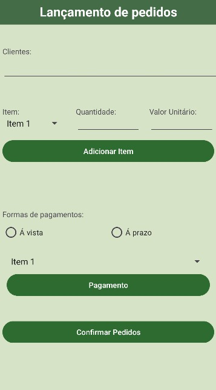
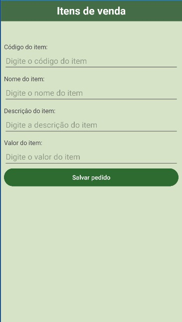

# Projeto de Ponto de Venda (PDV)

## Descrição

Este projeto é um aplicativo móvel para um sistema de ponto de venda (PDV) desenvolvido em Java usando IntelliJ IDEA como IDE principal.

## Tecnologias e Ferramentas Utilizadas

- Java
- IntelliJ IDEA
## Autor

Este projeto foi desenvolvido pelo seguinte estudantes da Universidade Paranaense (UNIPAR):

- [Pedro Henrique Pinheiro Rodrigues](https://github.com/R0DRlGUES)
- 
## Ilustração

  

 

## Licença

Este projeto é distribuído sob a licença [MIT](https://github.com/seu-usuario/seu-repositorio/blob/master/LICENSE). Consulte o arquivo `LICENSE` para obter mais informações.
